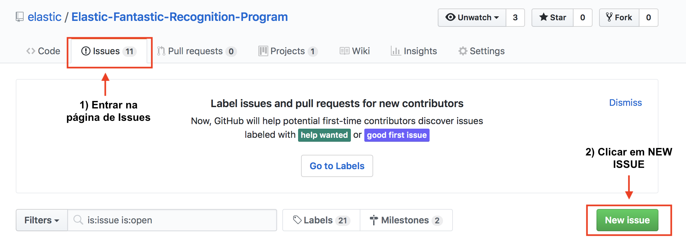
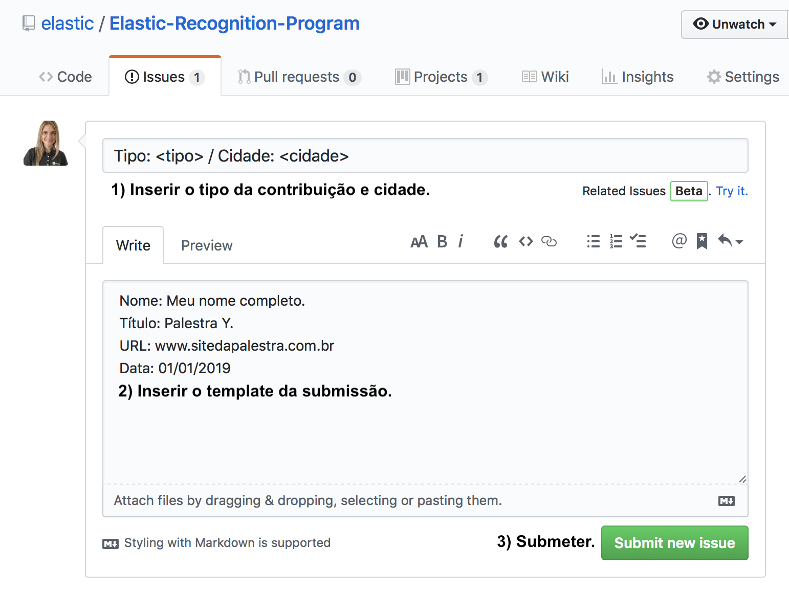
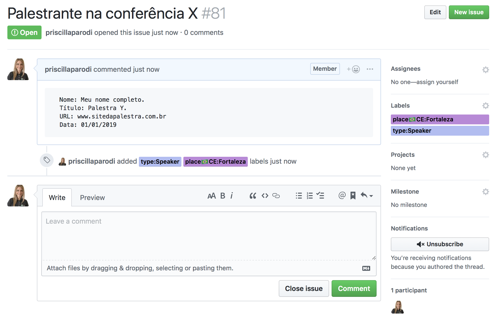
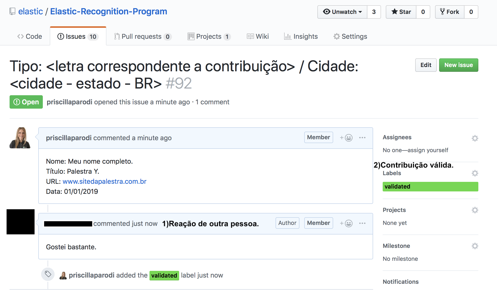

| [Home](https://elastic.github.io/Elastic-Recognition-Program/) |

## Documentação do programa de reconhecimento: ##

O projeto consiste em reconhecer e premiar os principais colaboradores da comunidade, incentivando a interação uns com os outros, a criação de conteúdo, o compartilhamento de conhecimento e, premiando esforços.

Existem várias maneiras para os membros da comunidade contribuírem, como:

      A) Organização de meetups, hackathons, eventos e workshops;
      B) Falando em conferências ou dando palestras em eventos e meetups;
      C) Criação de artigos ou posts em blogs;
      D) Tutoriais ou casos de uso em vídeos;
      E) Tradução de materiais existentes para idiomas locais;
      F) Contribuições com código;

### Regras para os conteúdos: ###

A) Organização de meetups, hackathons, eventos e workshops;

      A URL que prova a organização necessita ser pública.
      O nome completo do(a) organizador(a) deve aparecer na URL em local visível, o mesmo nome precisa estar no corpo da submissão.
      Caso você seja organizador(a) oficial da Elastic a URL deve ser a do evento criado no (meetup.com).
      Apenas eventos sobre os produtos e ferramentas da Elastic são válidos.
      Duração do evento: Mínimo de 1 hora.
      Local: Evento deve ser público e no caso de meetup, gratuito.
      Participantes: Mínimo de 10 participantes no local.

B) Apresentação de palestras em eventos, meetups ou conferências;

      A URL que comprova a palestra necessita ser pública, sem a necessidade de pagamento ou contribuição, registro/login são permitidos.
      O nome completo do(a) palestrante deve aparecer na URL em local visível, o mesmo nome precisa estar no corpo da submissão.
      Palestras em meetups são válidas, para isso a URL do evento no meetup deve estar com o seu nome como palestrante.
      Apenas palestras que abordem os produtos e ferramentas da Elastic são válidas. É permitido falar de outros temas na mesma palestra desde que as ferramentas da Elastic estejam no conteúdo.
      Material: A Elastic não fornece o material para o meetup mas caso haja o uso de templates da Elastic ou de materiais produzidos pela empresa ou terceiros, eles devem ser citados.
      Duração da apresentação: Mínimo de 15 minutos.
      Local: Evento deve ser público e no caso de meetup, gratuito.
      Participantes: Mínimo de 10 participantes no local.

C) Criação de artigos ou posts em blogs;

      A URL que prova a existência do artigo/blog precisa ser pública, sem a necessidade de pagamento ou contribuição, registro/login são permitidos.
      O nome completo do(a) autor(a) deve aparecer na URL em local visível, o mesmo nome precisa estar no corpo da submissão.
      Apenas artigos que abordem os produtos e ferramentas da Elastic são válidos. É permitido falar de outros temas no mesmo artigo desde que as ferramentas da Elastic estejam no conteúdo.
      Tamanho do texto: Ao menos 10 linhas.
      Observação: Em caso de plágio o participante não poderá mais submeter contribuições para o programa e sua participação será cancelada. Citações com as devidas referências são permitidas.  

D) Tutoriais ou casos de uso em vídeos;

      A URL que prova a existência do vídeo precisa ser pública, sem a necessidade de pagamento ou contribuição, registro/login são permitidos.
      O nome completo do(a) autor(a) deve aparecer na URL em local visível, o mesmo nome precisa estar no corpo da submissão.
      Apenas vídeos que abordem os produtos e ferramentas da Elastic são válidos. É permitido falar de outros temas no mesmo vídeo desde que as ferramentas da Elastic estejam no conteúdo.
      Tempo de vídeo: Mínimo de 5 minutos.
      Observação: Em caso de plágio o participante não poderá mais submeter contribuições para o programa e sua participação será cancelada. Citações com as devidas referências são permitidas. 

E) Tradução de materiais existentes para idiomas locais;

      A URL que comprova a existência do artigo/blog precisa ser pública, sem a necessidade de pagamento ou contribuição, registro/login são permitidos.
      Apenas texto é aceito.
      O nome completo do(a) autor(a) deve aparecer na URL em local visível, o mesmo nome precisa estar no corpo da submissão.
      A URL do conteúdo original deve ser citada.
      Apenas artigos que abordem os produtos e ferramentas da Elastic são válidos. É permitido falar de outros temas no mesmo artigo desde que as ferramentas da Elastic estejam no conteúdo.

F) Contribuições com código;

      O id do github da pessoa que contribuiu com o código deve ser o mesmo utilizado para a submissão no programa.
      O repositório deve ser público.
      A URL apontada deve ser a mesma que contenha a submissão ou conteúdo open source.
      Em caso de contribuição com o código da Elastic, ele deve estar no repo da Elastic.
      Em caso de criação de ferramenta open source, ela deve ser pública e estar diretamente relacionada aos produtos da Elastic.

### Para submeter uma contribuição é necessário: ###

1- Login no github com a sua conta, a conta não pode ser alterada durante as submissões visto que o usuário reconhecido será o da conta em questão.

2- Abrir uma issue no [repositório do programa](https://github.com/elastic/Elastic-Fantastic-Recognition-Program/issues), veja as instruções de como fazê-lo [aqui](https://help.github.com/en/articles/creating-an-issue).

**Atenção: Cada issue deve conter apenas uma (1) contribuição. Só é permitido 1 issue por submissão, caso tenha mais de uma contribuição crie novas issues.**

Preencher o campo "Title" da seguinte forma: 

      Tipo: <letra correspondente a contribuição> / Cidade: <cidade - estado - BR>
      
      A Letra deve ser, A,B,C,D,E ou F baseado no tipo de contribuição, que são as seguintes:
      
      A) Organizador(a)
      B) Palestrante
      C) Autor(a)
      D) Vídeos
      E) Tradução
      F) Contribuição com código
      
**Atenção: Apenas 1 (um) tipo e 1 (uma) cidade são permitidos.**

**Atenção: Para eventos, meetups, hackathons, colocar a cidade onde o evento foi realizado. Para artigos, vídeos e submissão de códigos, colocar a cidade onde você mora.**

No corpo da issue "Leave a comment", usar um desses templates:

A) Organizador(a)

      Nome: Seu nome completo.
      E-mail: Seu e-mail válido.
      Título: (Nome do meetup/hackathon/evento/workshop).
      URL: (URL do evento público criado no meetup.com em caso de meetups oficiais da Elastic ou em outras plataformas de evento públicas).
      Data: (Data do evento).

B) Palestrante

      Nome: Seu nome completo.
      E-mail: Seu e-mail válido.
      Título: (Nome da palestra).
      URL: (URL da palestra: página pública de inscrição, divulgação, etc, contendo o seu nome e título da palestra).
      Data: (Data da palestra).

C) Autor(a)
      
      Nome: Seu nome completo.
      E-mail: Seu e-mail válido.
      Título: (Título da publicação).
      URL: (URL pública da publicação).
      Data: (Data da publicação).

D) Vídeos

      Nome: Seu nome completo.
      E-mail: Seu e-mail válido.
      Título: (Título do vídeo).
      URL: (URL pública do vídeo).
      Data: (Data de publicação).

E) Tradução

      Nome: Seu nome completo.
      E-mail: Seu e-mail válido.
      Título: (Título do material).
      URL de origem: (URL pública do site oficial da Elastic "elastic.co" onde o material original se encontra).
      URL de destino: (URL pública do conteúdo original traduzido para o idioma local).
      Data: (Data de publicação).

F) Contribuição com código

      Nome: Seu nome completo.
      E-mail: Seu e-mail válido.
      Título: (Descrição do que foi submetido).
      URL: (URL com a submissão no repositório oficial da Elastic no github ou URL com a criação "open source" de features extras como contribuição os projetos da Elastic, o usuário do github deve ser o mesmo responsável pela submissão).
      Data: (Data da contribuição).

3- PRONTO, agora chame amigos(as) para comentar e/ou curtir a sua issue e faça isso com a dos outros membros. A interação da comunidade é importante para validarmos o conteúdo. Após a validação a Elastic adicionará os labels de cidade, tipo e "validated".

### Imagens de exemplo correspondentes aos passos aqui colocados: ###

**Passo 1) Abrindo uma issue:**

**Passo 2) Inserindo as informações da issue:**

**Passo 3) Exemplo de issue já submetida, a sua deve ficar de maneira similar:**

**Exemplo de issue já validada após reação de outro participante (neste caso, comentário) + label de validação adicionada pela Elastic:**

### Validação da submissão: ###

Sua submissão deve seguir as instruções a seguir:

      Issue aberta no login da pessoa que submeteu;
      No título da issue, deve conter a cidade e a letra correspondente ao tipo de contribuição;
      No corpo da issue, deve conter a descrição seguindo o template e regras;
      É necessário ao menos uma (1) interação de outra pessoa na issue para validarmos o conteúdo, seja comentário, like ou reações - chame os(as) amigos(as) para participarem!
      Obs: Quem participa do programa também é incentivado(a) a contribuir com comentários e reações.
      Após validado a Elastic adicionará o label: "validated" e os labels de cidade e tipo.

Caso suspeite de plágio ou fraudes, é importante alertar nos comentários da issue correspondente. Assim conseguimos assegurar a idoneidade do programa para toda a comunidade.

Contamos também com engenheiros(as) da Elastic para validação. 

### Datas e prazos: ###

Os prazos para submissões e data limite para a criação de conteúdo, são divulgados sempre que um novo ciclo de submissão é aberto. Caso o prazo já tenha se encerrado a sua contribuição conta para o ano seguinte.

Veja a próxima data aqui:

Data para submissões:

Início: **31/05/2019.**

Fim: **01/11/2019.**

Data de criação do conteúdo:

Desde **01/05/2018.**

Até **31/10/2019.**

Divulgação do último ranking e último reconhecimento:

**15/11/2019.**

**Excepcionalmente nesta primeira edição, a duração é de mais de 12 meses para submissões e para a data de envio.**

### Divulgação: ###

O ranking oficial será divulgado 3 meses após a abertura das submissões. Você pode acompanhar o ranking atualizado mensalmente nos canais: [Grupo Oficial de Facebook](https://www.facebook.com/groups/2538162326271261/) e no [GitHub](https://elastic.github.io/Elastic-Recognition-Program/ranking-piloto).

### Regras de pontuação: ###

A) Organização de meetups, hackathons, eventos e workshops;

      Pontos = 6 pontos cada.

B) Apresentação de palestras em eventos, meetups ou conferências;

      Pontos = 6 pontos cada.

C) Criação de artigos ou posts em blogs;

      Pontos = 4 pontos cada.

D) Tutoriais ou casos de uso em vídeos;

      Pontos = 4 pontos cada.

E) Tradução de materiais existentes para idiomas locais;

      Pontos = 2 pontos cada.

F) Contribuições com código;

      Pontos = 6 pontos cada.

### Empate: ###

Caso haja um empate entre dois ou mais, vamos considerar:

      1- Quem conseguiu os pontos que causaram o empate antes;

      2- Número de itens com o valor de ponto mais alto;

### Níveis de reconhecimento: ###

      1) Elastic GOLD
      2) Elastic SILVER
      3) Elastic BRONZE

O número de premiados é limitado a um número previamente definido pela equipe do local. Para a primeira edição do programa no Brasil, o número está limitado a 30 pessoas.

Entre os premiados, 10% com as maiores pontuações serão Elastic Gold; 30% com as pontuações mais altas depois dos Elastic Gold, serão Elastic Silver e 60% com as pontuações mais altas depois dos Elastic Silver serão Elastic Bronze.

A validade do reconhecimento é de 12 meses a partir da data do último reconhecimento do ano.

### Reconhecimento ###

| Reconhecimento | BRONZE | SILVER | GOLD |
| :---:| :---: | :---: | :---: |
| Viagem para São Francisco - Califórnia - USA | Não | Não | Sim |
| Treinamento Eng. I e II | Não | Não | Sim |
| Embaixador(a) Elastic | Não | Não | Sim |
| Certificação  | Não  | Sim  | Sim |
| Elastic Community Summit 2019 | Sim | Sim | Sim |
| Treinamento no Community Summit 2019 | Não | Sim | Sim |
| Apresentação no Community Summit 2019 | Submissão | Submissão | Convite |
| Virtual Meetup | Sim  | Sim | Sim |
| Brindes exclusivos | Sim | Sim | Sim |

**Brindes exclusivos:**

Brindes exclusivos da Elastic com base no nível de reconhecimento (Bronze, Silver, Gold).

**Embaixador(a) Elastic:**

Certificado emitido pela Elastic reconhecendo as contribuições em prol da comunidade. O certificado terá validade de 1 ano e durante esse período, o(a) embaixador(a) Elastic será convidado para fazer apresentações em eventos patrocinados pela Elastic.

**Virtual Meetup:**

Meetup virtual com o objetivo de atualizar o conhecimento dos participantes sobre as ferramentas e novidades com a presença de Engenheiros(as) da Elastic.

**Elastic Community Summit 2019:**

Summit em São Paulo (Brasil) exclusivo para a comunidade e parceiros da Elastic, com apresentações do time de engenharia da empresa e de membros da comunidade.

**Treinamento no Community Summit 2019:**

Treinamento com um engenheiro da Elastic sobre o Stack.

**Apresentação no Community Summit 2019:**

Teremos slots para apresentação no Summit, os reconhecidos GOLD vão ser convidados e BRONZE e SILVER podem submeter tópicos que serão passíveis de aprovação. A palestra pode ser sobre alguma ferramenta da Elastic ou sobre algo relacionado a comunidade Elastic.

**Certificação:**

Os reconhecidos SILVER e GOLD terão isenção da taxa para a realização de uma (1) prova de [certificação](https://www.elastic.co/training/certification) cada. 

**Treinamento Eng. I e II:**

[Treinamento Eng. I](https://www.elastic.co/training/elasticsearch-engineer-1) e [Treinamento Eng II](https://www.elastic.co/training/elasticsearch-engineer-2) a ser realizado no Brasil.

**Viagem para São Francisco - Califórnia - USA:**

Os reconhecidos GOLD ganharão uma viagem para São Francisco - Califórnia - USA incluindo:

      Hospedagem e passagens aéreas (saindo e voltando para o Brasil).
      Visita ao escritório da Elastic em Montain View - Califórnia - USA.
      Ingresso para o Elastic{On} Tour em São Francisco - Califórnia - USA.
      
* Atenção: Para a viagem é necessário possuir **passaporte válido**. (O passaporte precisa ter validade de no mínimo, até 6 meses antes da data da viagem, que será realizada em Março de 2020 e possuir o visto americano colado em uma de suas páginas) e **seguro viagem**.
